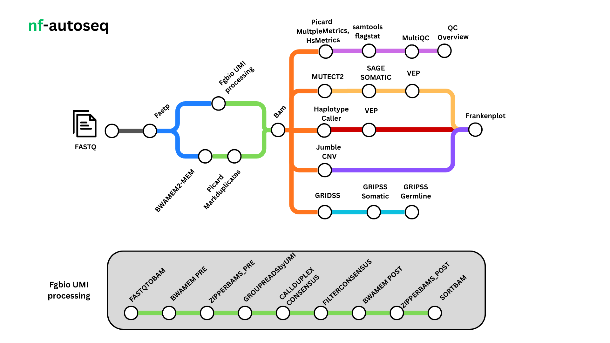

<h1>
  <picture>
    <source media="(prefers-color-scheme: dark)" srcset="docs/images/nf-core-autoseq_logo_dark.png">
      <center></center>
  </picture>
</h1>

[](https://github.com/codespaces/new/genomic-medicine-sweden/autoseq)
[](https://github.com/genomic-medicine-sweden/autoseq/actions/workflows/nf-test.yml)
[](https://github.com/genomic-medicine-sweden/autoseq/actions/workflows/linting.yml)[](https://nf-co.re/autoseq/results)[](https://doi.org/10.5281/zenodo.XXXXXXX)
[](https://www.nf-test.com)

[](https://www.nextflow.io/)
[](https://github.com/nf-core/tools/releases/tag/3.5.2)
[](https://docs.conda.io/en/latest/)
[](https://www.docker.com/)
[](https://sylabs.io/docs/)
[](https://cloud.seqera.io/launch?pipeline=https://github.com/imsarath/nf-core-autoseq)

[](https://nfcore.slack.com/channels/autoseq)[](https://bsky.app/profile/nf-co.re)[](https://mstdn.science/@nf_core)[](https://www.youtube.com/c/nf-core)

## Introduction

**genomic-medicine-sweden/autoseq** is a Nextflow pipeline designed for deep targeted sequencing and whole-exome data. It automates essential steps from quality control to variant calling. The pipeline annotates variants using [`VEP`](https://www.ensembl.org/info/docs/tools/vep/index.html)! and applies sophisticated semantic filters to eliminate irrelevant and non-significant calls. The final output is optimized for manual curation in tools like IGV and can be exported as a text, HTML, or PDF report.

## Pipeline overview



1. Read QC ([`FastQC`](https://www.bioinformatics.babraham.ac.uk/projects/fastqc/))
2. Adapter trimming ([`FastP`](https://github.com/OpenGene/fastp))
3. Alignment to reference genome ([`BWAMEM2`](https://github.com/bwa-mem2/bwa-mem2))
4. Post-alignment QC ([`Picard - CollectHsMetrics, CollectMultipleMetrics`](https://broadinstitute.github.io/picard/))
5. UMI Processing ([`Fgbio`](https://fulcrumgenomics.github.io/fgbio/))
6. Somatic Variant Calling ([`GATK Mutect2`](https://gatk.broadinstitute.org/hc/en-us/articles/30332058799003-Mutect2), [`SAGE`](https://github.com/hartwigmedical/hmftools/tree/master/sage))
7. Germline Variant Calling ([`GATK HaplotypeCaller`](https://gatk.broadinstitute.org/hc/en-us/articles/30332006386459-HaplotypeCaller), )
8. Structural Variant Calling and Filtering ([`GRIDSS`](https://github.com/PapenfussLab/gridss), [`GRIPSS`](https://github.com/hartwigmedical/hmftools/tree/gripss-v2.4/gripss))
9. Copy Number Variant Calling ([`Jumble`](https://github.com/ClinSeq/jumble))
10. Annotation of variants ([`VEP`](https://www.ensembl.org/info/docs/tools/vep/index.html))
11. PureCN for CNV annotation and purity/ploidy estimation ([`PureCN`](https://github.com/lima1/PureCN))
12. MSIsensor2 for MSI status estimation ([`MSIsensor2`](https://github.com/niu-lab/msisensor2))
13. Summary of QC metrics ([`MultiQC`](http://multiqc.info/))

## Usage

> [!NOTE]
> If you are new to Nextflow and nf-core, please refer to [this page](https://nf-co.re/docs/usage/installation) on how to set-up Nextflow. Make sure to [test your setup](https://nf-co.re/docs/usage/introduction#how-to-run-a-pipeline) with `-profile test` before running the workflow on actual data.

Create a samplesheet with your input data that looks as follows: `samplesheet.csv`

```csv
case_id,sample_name,sample_type,lane,fastq_1,fastq_2,bam
PATIENT_ID,TUMOR_ID,tumor,L2,/path/to/SAMPLE_L2_R1_001.fastq.gz,/path/to/SAMPLE_L2_R2_001.fastq.gz,
PATIENT_ID,TUMOR_ID,tumor,L3,/path/to/SAMPLE_L3_R1_001.fastq.gz,/path/to/SAMPLE_L3_R2_001.fastq.gz,
PATIENT_ID,NORMAL_ID,normal,L4,/path/to/SAMPLE_L4_R1_001.fastq.gz,/path/to/SAMPLE_L4_R2_001.fastq.gz,
PATIENT_ID,NORMAL_ID,normal,L5,/path/to/SAMPLE_L5_R1_001.fastq.gz,/path/to/SAMPLE_L5_R2_001.fastq.gz,
```

Now, you can run the pipeline using:

```bash
nextflow run nf-autoseq/main.nf \
   -profile <docker/singularity/.../institute> \
   --input samplesheet.csv \
   --outdir results/  \
   --ref_genomes_base /path/to/ref_genomes_base/
```

> [!WARNING]
> Please provide pipeline parameters via the CLI or Nextflow `-params-file` option. Custom config files including those provided by the `-c` Nextflow option can be used to provide any configuration _**except for parameters**_; see [docs](https://nf-co.re/docs/usage/getting_started/configuration#custom-configuration-files).

For more details and further functionality, please refer to the [usage documentation]() and the [parameter documentation]().

## Pipeline output

To see the results of an example test run with a full size dataset refer to the [results]() tab on the nf-core website pipeline page.
For more details about the output files and reports, please refer to the
[output documentation]().

## Credits

`nf-autoseq` was originally written by Sarath Kumar Murugan.

<!-- We thank the following people for their extensive assistance in the development of this pipeline: -->

<!-- TODO nf-core: If applicable, make list of people who have also contributed -->

## Contributions and Support

If you would like to contribute to this pipeline, please see the [contributing guidelines](.github/CONTRIBUTING.md).

For further information or help, don't hesitate to get in touch on the [Slack `#autoseq` channel](https://nfcore.slack.com/channels/autoseq) (you can join with [this invite](https://nf-co.re/join/slack)).

## Citations

<!-- TODO nf-core: Add citation for pipeline after first release. Uncomment lines below and update Zenodo doi and badge at the top of this file. -->
<!-- If you use genomic-medicine-sweden/autoseq for your analysis, please cite it using the following doi: [10.5281/zenodo.XXXXXX](https://doi.org/10.5281/zenodo.XXXXXX) -->

<!-- TODO nf-core: Add bibliography of tools and data used in your pipeline -->

An extensive list of references for the tools used by the pipeline can be found in the [`CITATIONS.md`](CITATIONS.md) file.

You can cite the `nf-core` publication as follows:

> **The nf-core framework for community-curated bioinformatics pipelines.**
>
> Philip Ewels, Alexander Peltzer, Sven Fillinger, Harshil Patel, Johannes Alneberg, Andreas Wilm, Maxime Ulysse Garcia, Paolo Di Tommaso & Sven Nahnsen.
>
> _Nat Biotechnol._ 2020 Feb 13. doi: [10.1038/s41587-020-0439-x](https://dx.doi.org/10.1038/s41587-020-0439-x).
